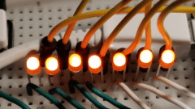
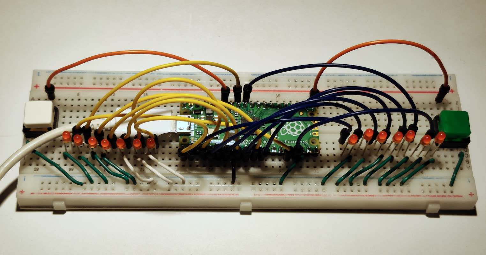
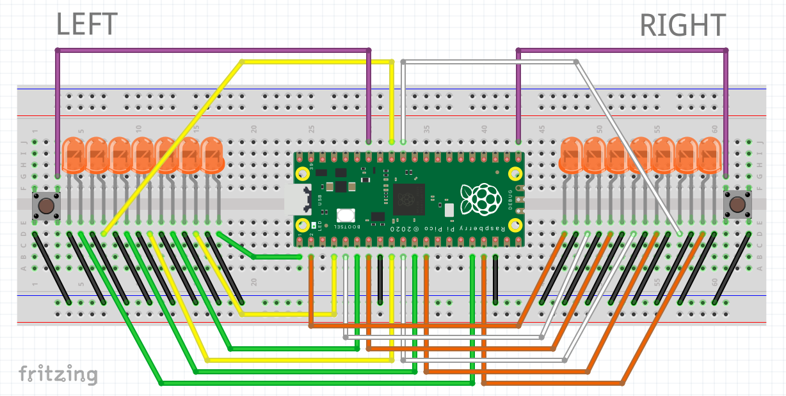

# Animated LED Light Bars As Blinkers

**Note**: This is an experimental prototype for learning purposes.

The project features button-triggered turn signals (or blinkers) with a smooth dynamic animation controlling the LEDs, powered by Raspberry Pi Pico. The script is written in MicroPython 1.17.

The LEDs keep blinking as shown below while the button stays depressed. If both buttons are depressed, the LEDs blink alternating left and right.

Left blinker executing the blinking sequence:

Assembled project on a breadboard:

[ Click for full size](blinkers.jpg)

## Software

When the project is built, make sure your board runs MicroPython 1.17, then upload and execute [`blinkers.py`](blinkers.py).

If you're a beginner and need help with setting up the Pico, see:

* Getting Started With The Pico: https://projects.raspberrypi.org/en/projects/getting-started-with-the-pico
* MicroPython firmware: https://micropython.org/download/rp2-pico/

## Components

Wiring of the components:

[ Click for full size](diagram.png)

Component | Amount
-- | --
Raspberry Pi Pico | 1
Breadboard | 1
Push buttons | 2
LEDs | 14
Wires | At least 34

To downscale the project, you can just build one of the arrays (left or right). You can also reduce the number of LEDs in the array by deleting the corresponding GPIOs in the Python script accordingly.

### Note on LEDs and PWM channels

The build seen in the pictures uses orange 3 mm LEDs but any type of LED should work.

Also, you can add one more pair by using GPIOs 14 and 15. You need to add the LEDs following the wiring pattern and append the GPIO numbers to the arrays in the Python script (see below). These will make use of the last available PWM channels on the Pico, so 8 × 2 LEDs is the maximum.

    # GPIO numbers 14 and 15 appended to support the eighth pair of LEDs
    LEFT_BLINKER_GPIOS = [0, 2, 4, 6, 8, 27, 12, 14]
    RIGHT_BLINKER_GPIOS = [1, 3, 5, 7, 9, 26, 13, 15]

Yes, you can make a single 16-LED-long blinker by combining all of the GPIOs into one array.

# License

MIT License
